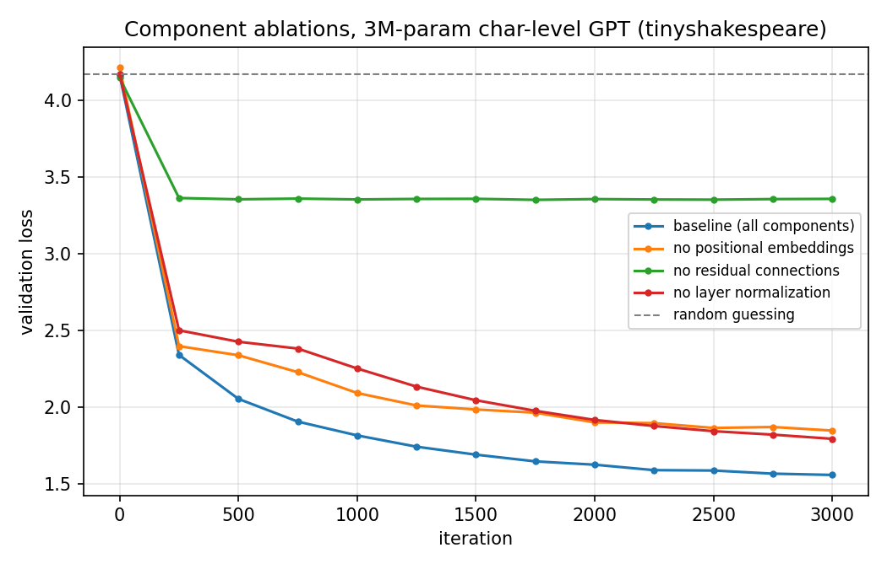

# Ablation results

All runs: 3000 iterations, identical seed, identical hyperparameters. Only the named component differs.

| configuration | params | final val loss | vs baseline | vs random |
|---|---|---|---|---|
| baseline (all components) | 3,222,528 | 1.5571 | — | 2.6173 |
| no positional embeddings | 3,189,760 | 1.8466 | +0.2894 | 2.3278 |
| no residual connections | 3,222,528 | 3.3592 | +1.8020 | 0.8152 |
| no layer normalization | 3,217,920 | 1.7929 | +0.2358 | 2.3814 |

Random-guess baseline: 4.1744

